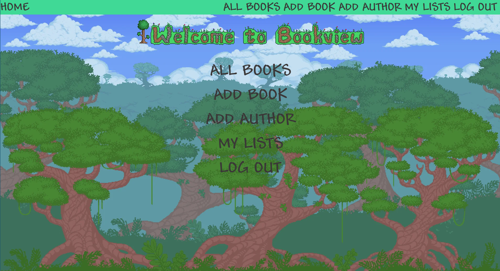
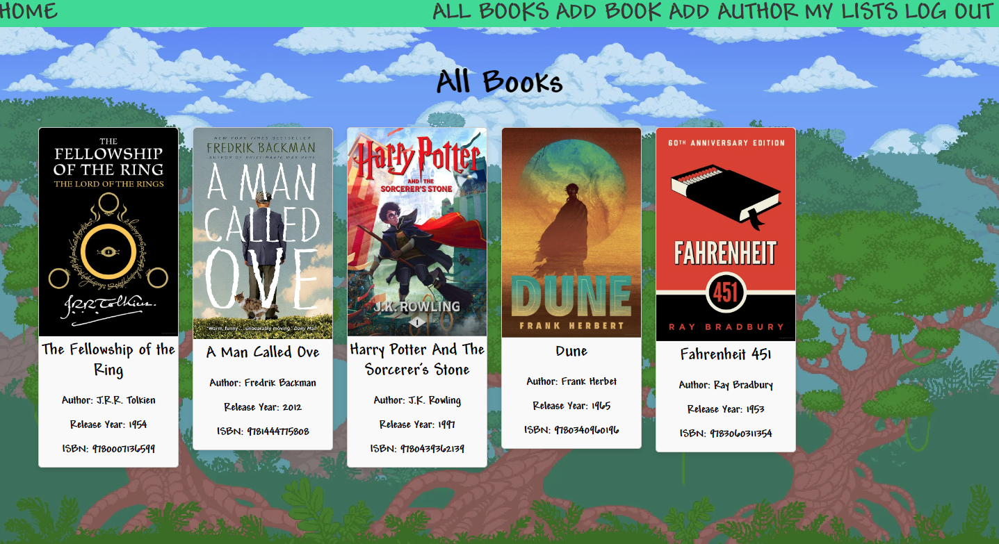
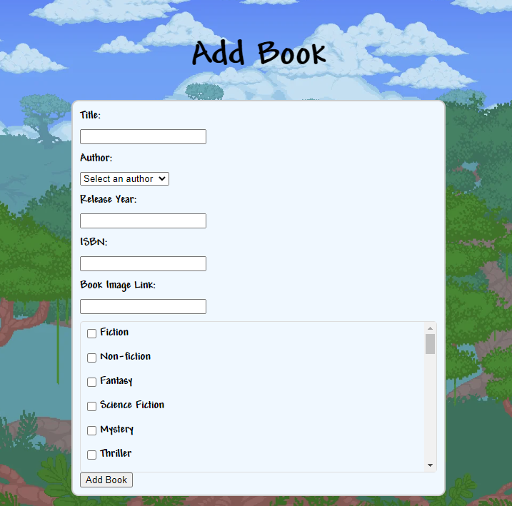

# Bookview
This application is a book management system that allows users to add, view, and manage books and authors. Users can add new books, associate them with authors, view book details, and manage book lists. Additionally, users can write and view reviews for books. The application supports user authentication and provides personalized features such as user-specific book lists.

# Screenshot

# Technologies Used

- Node
- JavaScript
- HTML
- CSS
- Mongoose
- MongoDB
# Getting Started

[Click to View Project Planning](https://trello.com/b/jm4A5V6g/bookie)
[Click to use Bookview](https://bookie-application-f53869e4de71.herokuapp.com/)

# Next Steps

- Can add to list from book details page
- Can create authors from add book page
- Can edit book details if you are user that created that entry